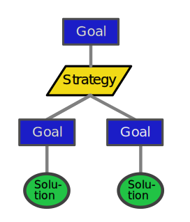

# REAMDME for ecCausaSnipper

A Prolog powered browser game about GSN trees.

It purpuse is to have fun and to tell something about bad GSN trees. GSN is the Goal Structured Notation Standard, which you can find [here](https://www.goalstructuringnotation.info/).

The aim of this easy graphical is to visualize an argumantation strategy. In princpile this looks like this

The top goal is to argue, strategies tell how the goals below this strategy will support your argument that the goal above the strategy is true. All argumentation ends in an evidence like a document, a image etc. which is symbolized by the "Solution".

### Game Play

Game play is not finally defined. But it will be around growing GSN trees and bring them in a shape which is usefull. Some experience of myself how to great good argumentation GSN trees will be put into this game.

### Further details

Some initial documentation like rule specification and other things can be found at  [doc/eccs-rulefactsheet.xlsx](doc/eccs-rulefactsheet.xlsx)

## License

License ist MIT. The software is provided as is with no warranties.
